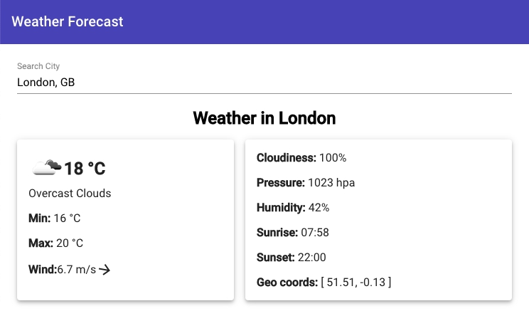

# Open Weather

This project can display current weather in your town.

## Pre Requirements
- Be sure you have installed `node v10.15` or more.
- run `npm install` for install all dependency

## Run Project
- `npm start` - build the project for development. Navigate to `http://localhost:4200/`
- `npm run build` - build project for production into `./dist` folder.

## Run Tests
- `npm test` -  to execute the unit tests via [Karma](https://karma-runner.github.io).
- `npm run e2e` - to execute the end-to-end tests via [Protractor](http://www.protractortest.org/).

## Run linting project
For lint project using [tslint](https://palantir.github.io/tslint/) and [stylelint](https://stylelint.io/)

- `npm run lint` - execute linting for `.ts` files as well as `.scss` files

## Project Architecture
- **e2e** - contain ent-to-end tests
- **src** - source files folder
  - **app** - main working folder with necessary components/modules
    - **material** - contain `material.module.ts` where all necessary material modules are included
    - **shared** - contain shared elements (which might be used in any component)
      - **models** - contain all necessary Interfaces for server response (city, open-weather)
      - **pipes** - pipes they are help display information in correct format
      - **services** - contain services which are send request to the API and service which are necessary for configure API key (`weather-forecast.config`)
    - **testing** - contain city and open-weather response mock.
    - **weather-forecast** - module contain all component which are responsible for display current weather
      - **city-autocomplete** - component which responsible for search city

## Project specification

Project build thought [ng cli](https://cli.angular.io/) and use [Angular Material](https://material.angular.io) for styling.

Search by city use `city.list.json.gz` and ungzip on the client side thought [pako](https://www.npmjs.com/package/pako) package.
